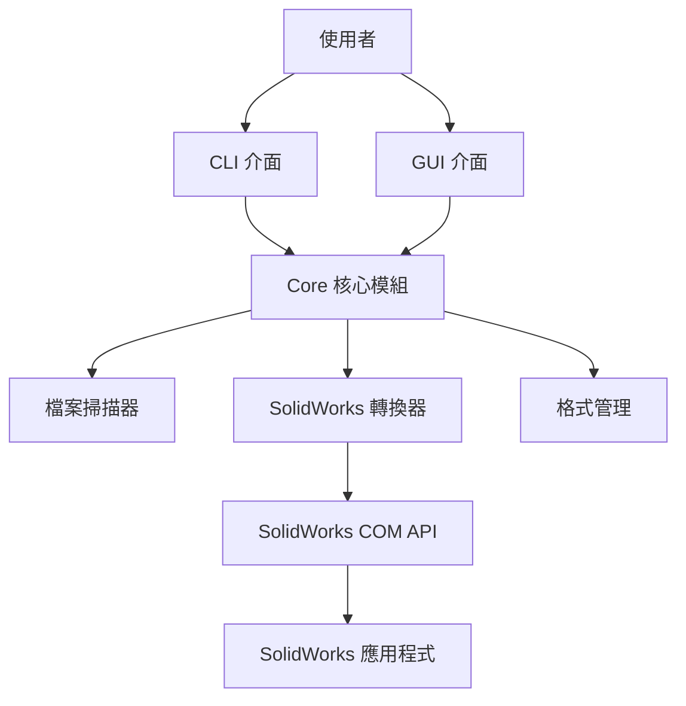

# 架構設計文件

本文件說明 SolidWorks Batch Export 的技術架構與核心設計決策。

## 系統架構



## 模組職責

### CLI 模組 (`cli/`)

- 使用 **Typer** 框架處理命令列參數
- 使用 **Rich** 提供豐富的終端輸出（進度條、表格、樹狀圖）
- 呼叫 `core` 模組執行實際轉檔
- 不包含業務邏輯，只負責使用者互動

### GUI 模組 (`gui/`)

- 使用 **Tkinter** 建立圖形介面
- 背景執行緒執行轉檔（避免凍結 UI）
- 呼叫 `core` 模組執行實際轉檔
- 不包含業務邏輯，只負責使用者互動

### Core 模組 (`core/`)

CLI 和 GUI 的**共用核心邏輯**，包含：

- **`scanner.py`**: 檔案掃描、任務建立
- **`converter.py`**: SolidWorks COM 操作、批次轉檔
- **`formats.py`**: 格式定義與解析
- **`validation.py`**: 路徑驗證（GUI 專用）
- **`paths.py`**: 路徑處理（開發/打包模式差異）
- **`logging_config.py`**: 日誌配置

## 關鍵設計決策

### 1. COM 執行緒安全

**問題**：SolidWorks COM API 要求 STA (Single-Threaded Apartment) 模式，所有 COM 操作必須在同一執行緒。

**解決方案**：

- **CLI**：主執行緒直接執行，無需額外處理
- **GUI**：使用 `threading.Thread` 建立背景執行緒
  - 在執行緒內呼叫 `pythoncom.CoInitialize()`
  - 所有 COM 操作在此執行緒內完成
  - 使用 `queue.Queue` 與主執行緒（GUI）通訊

```python
# GUI 背景執行緒範例
import pythoncom

def conversion_thread():
    pythoncom.CoInitialize()  # 初始化 COM
    try:
        with SolidWorksConverter(visible=False) as converter:
            converter.convert_batch(...)
    finally:
        pythoncom.CoUninitialize()  # 清理
```

### 2. 進度回呼機制

**問題**：CLI 和 GUI 需要不同的進度顯示方式。

**解決方案**：`convert_batch()` 接受 `on_progress` callback：

```python
def on_progress(
    current: int,
    total: int, 
    task: ConversionTask,
    status: ConversionStatus | None
) -> None:
    # status=None: 開始處理此檔案
    # status 有值: 處理完成
    pass
```

- **CLI**：更新 Rich 進度條
- **GUI**：透過 Queue 更新 TreeView

### 3. 跳過邏輯（增量轉檔）

**問題**：如何判斷檔案是否需要重新轉檔？

**解決方案**：

1. `ConversionTask.needs_conversion()` 比較來源與目標檔案的 mtime
2. 每種輸出格式獨立判斷
3. 統一在 `convert_batch(skip_existing=...)` 控制

```python
def needs_conversion(self) -> bool:
    if not output_path.exists():
        return True
    return self.source_path.stat().st_mtime > output_path.stat().st_mtime
```

### 4. SaveAs3 vs SaveAs

**問題**：SolidWorks API 有兩種儲存方法。

**解決方案**：

- 優先使用 `SaveAs3`（可取得詳細錯誤碼）
- 舊版 SolidWorks 不支援時自動 fallback 到 `SaveAs`

```python
try:
    success, errors, warnings = model.Extension.SaveAs3(...)
except AttributeError:
    success = model.SaveAs(...)
```

### 5. UI 狀態更新

**問題**：GUI 如何更新正確的 TreeView 項目？

**解決方案**：

- 使用 **task index** 而非檔名比對
- 避免不同目錄中同名檔案的誤更新

```python
# 儲存 index 到 TreeView item
item_id = self.tree.insert(..., values=(task_idx, ...))

# 更新時使用 index 查找
for item in self.tree.get_children():
    if self.tree.item(item)['values'][0] == task_idx:
        self.tree.item(item, tags=('completed',))
```

### 6. 日誌路徑處理

**問題**：開發模式和打包後的日誌位置不同。

**解決方案**：`paths.get_log_dir()` 智慧判斷：

1. **開發模式** (`sys.frozen == False`): `./logs/`
2. **打包後**: `%LOCALAPPDATA%\swbatch\logs`
3. **備援**: `~/.swbatch/logs`

## SolidWorks COM API 關鍵點

### 文件類型常數

```python
SW_DOC_PART = 1      # .sldprt
SW_DOC_ASSEMBLY = 2  # .sldasm
```

### 開啟文件

```python
model = swApp.OpenDoc(str(path), doc_type)
if model is None:
    # 開啟失敗
```

### 儲存為其他格式

```python
# SaveAs3（推薦）
success, errors, warnings = model.Extension.SaveAs3(
    str(output_path),
    version,
    options,
    export_data,
    pdf_data
)

# SaveAs（fallback）
success = model.SaveAs(str(output_path))
```

### 關閉文件

```python
# 注意：GetTitle 是屬性，不是方法！
swApp.CloseDoc(model.GetTitle)  # 正確
# swApp.CloseDoc(model.GetTitle())  # 錯誤！
```

## 資料流程

### CLI 轉檔流程

```
使用者輸入 --> Typer 解析參數 --> FileScanner 掃描檔案 --> 
ConversionTask 列表 --> SolidWorksConverter.convert_batch() -->
逐一開啟/轉檔/關閉 --> ConversionStats 統計 --> 顯示結果
```

### GUI 轉檔流程

```
使用者選擇目錄 --> 掃描檔案 --> 顯示在 TreeView -->
使用者勾選 --> 點擊開始 --> 建立背景執行緒 -->
執行緒內 convert_batch() --> Queue 傳遞進度 -->
主執行緒更新 GUI --> 完成後顯示統計
```

## 平台需求

- **作業系統**：Windows 10/11（SolidWorks COM API 僅支援 Windows）
- **SolidWorks**：已安裝且可運行
- **Python**：3.10+

## 相關文件

- [使用者指南](USER_GUIDE.md)
- [開發者指南](DEVELOPMENT.md)
- [打包部署指南](PACKAGING.md)
- [日誌配置](LOGGING.md)
